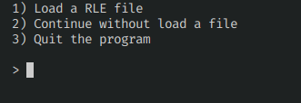
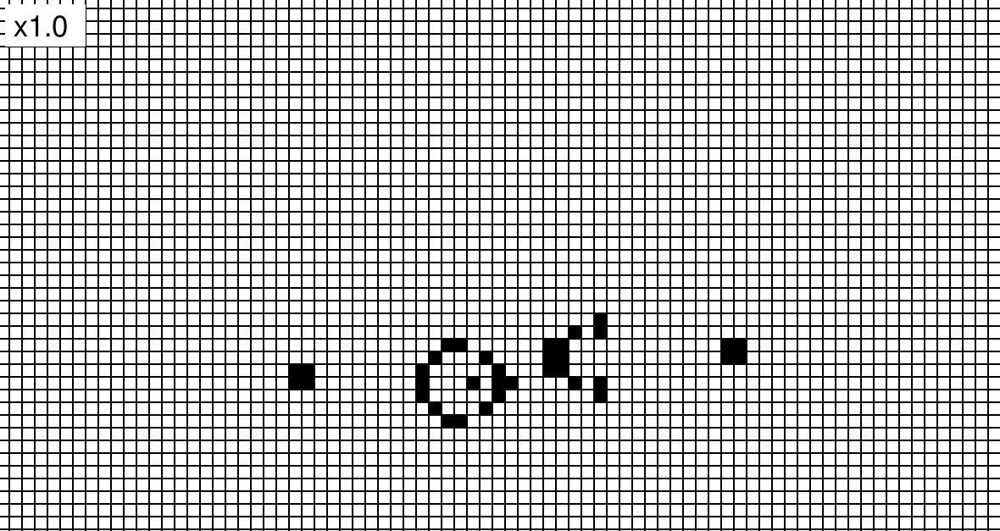
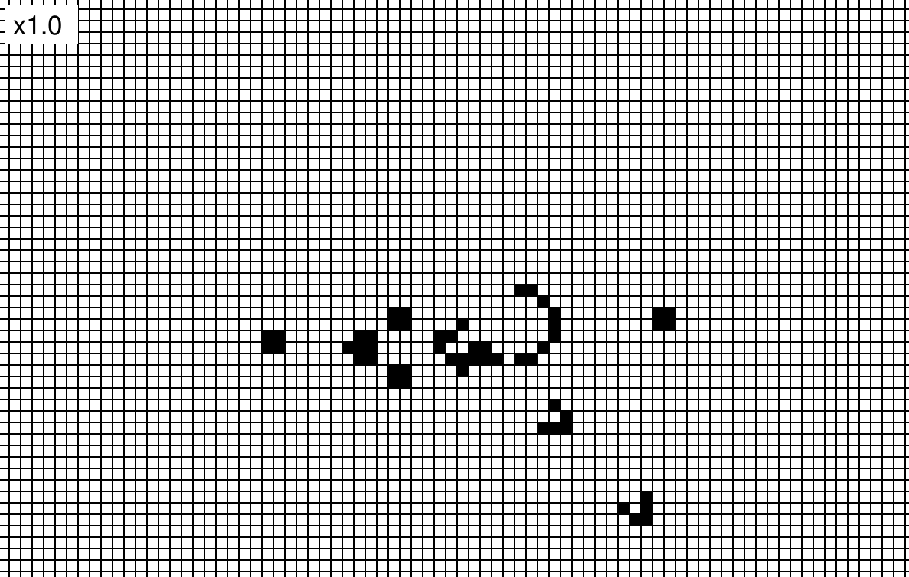

# game-of-life

The Conway's Game of Life written with Pygame. 

# Usage

You can load a pattern file or create your own pattern:

An initial pattern:

To start the simulation, you can press **SPACE**:
> A frame from the simulation

To pause/resume the simulation, you can press **ENTER**
